## Introduction
https://www.youtube.com/watch?v=lrXpTVEAXCM&list=PLFdAYMIVJQHN6J5-OCh7pbG0o8WHC9so3&index=1
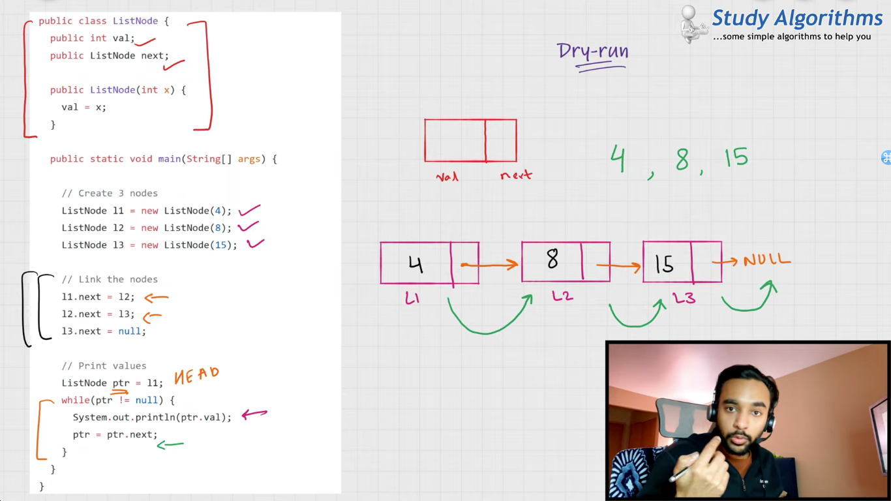

## Traverse a LL
https://www.youtube.com/watch?v=bJfLV76DQFE&list=PLFdAYMIVJQHN6J5-OCh7pbG0o8WHC9so3&index=2
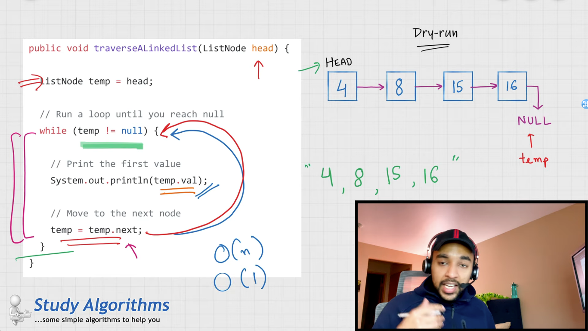

## Insert Node
https://www.youtube.com/watch?v=5ao9KfGga3c&list=PLFdAYMIVJQHN6J5-OCh7pbG0o8WHC9so3&index=3
at middle
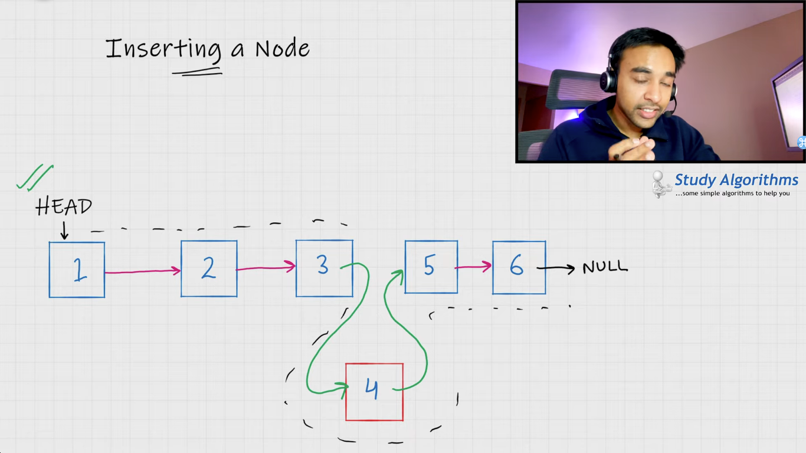
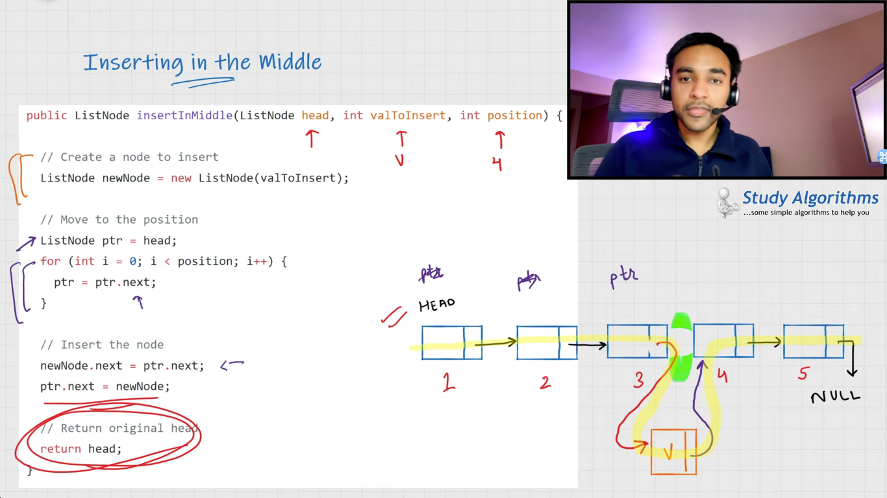
at begining
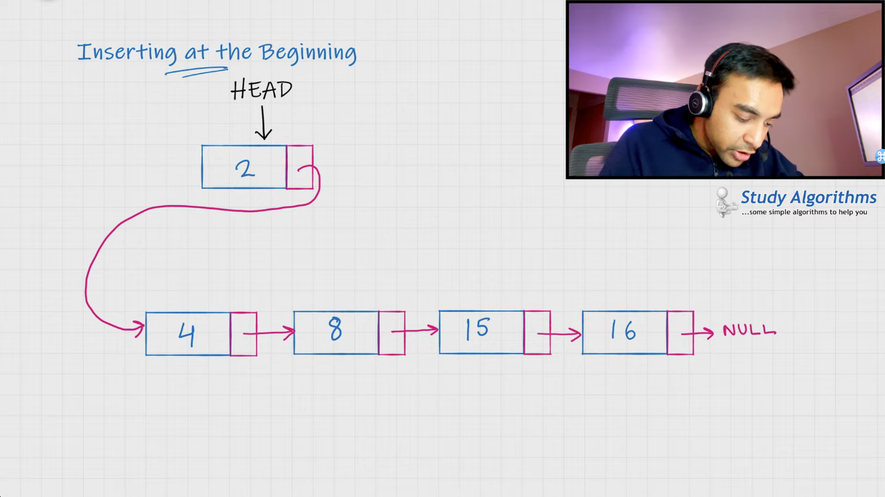

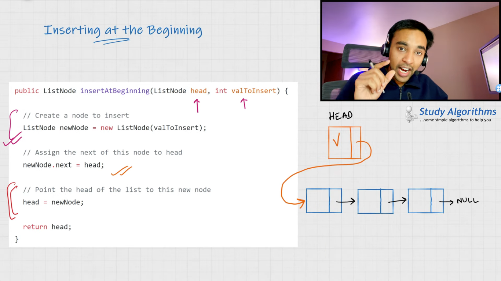
at the end
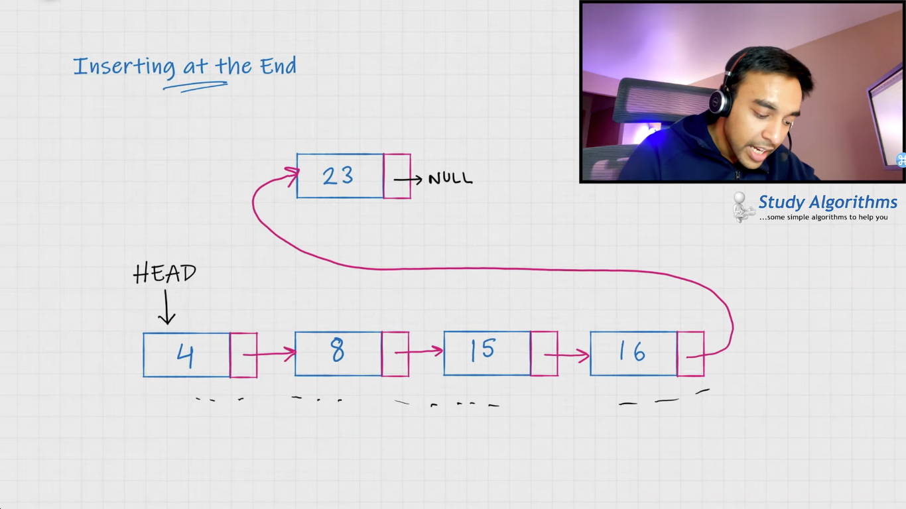
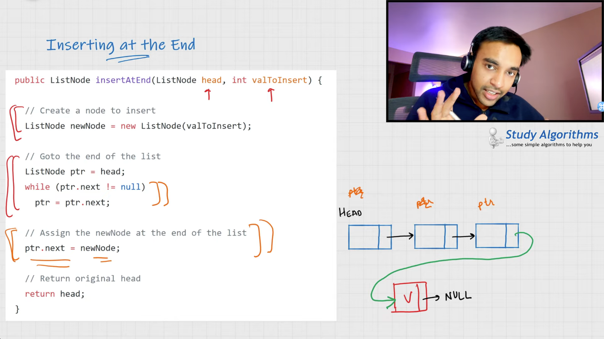

## Delete Node
at middle
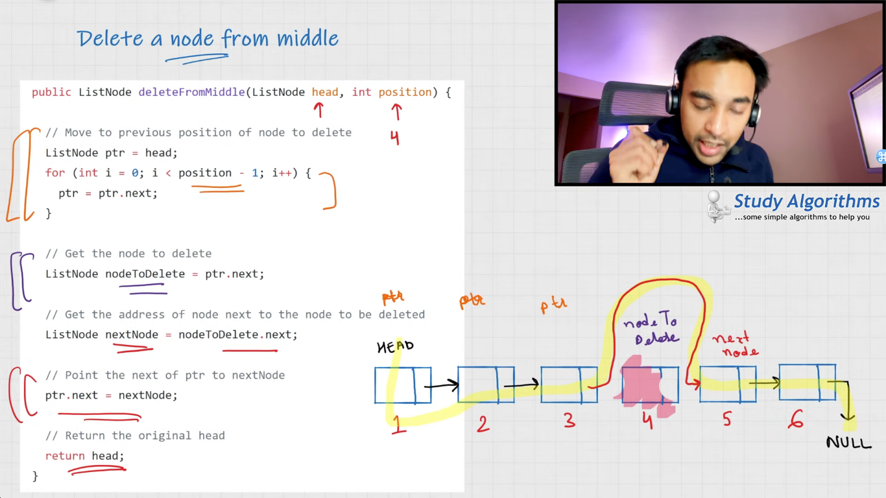
at begining
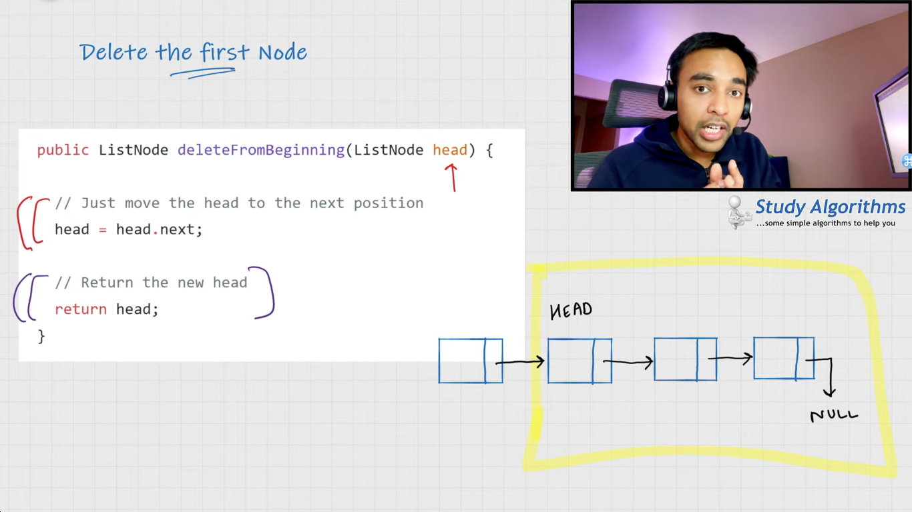
at the end
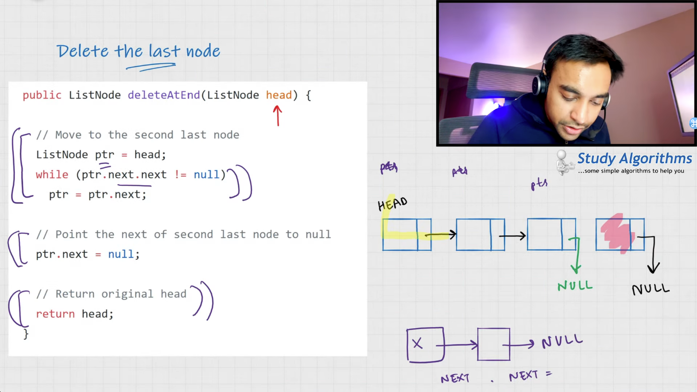