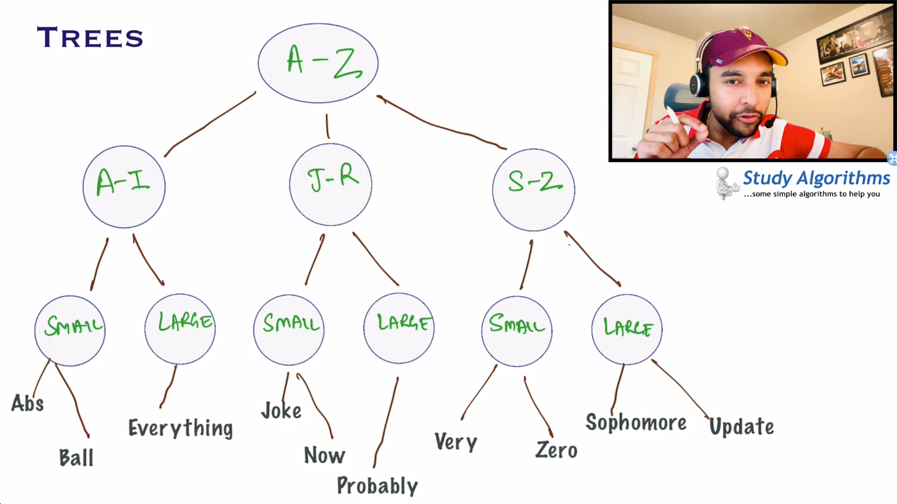

## Introduction
https://www.youtube.com/watch?v=PzpmrQjIzYY&list=PLFdAYMIVJQHPswf74XJDtuWV-4BOeP65l&index=1

linear ds(like array, ll, stack) need to iterate one-by-one cannot skip
wheareas non-linear ds(tree & graph)  if data will increase drastically

## Nodes & Edges
https://www.youtube.com/watch?v=6jwUjPs27Pc&list=PLFdAYMIVJQHPswf74XJDtuWV-4BOeP65l&index=2

## Binary Tree[Each node can have max 2 children]
https://www.youtube.com/watch?v=jxdEgfAsEg0&list=PLFdAYMIVJQHPswf74XJDtuWV-4BOeP65l&index=3

## Creating Binary Tree

## In-Order Traverse
https://www.youtube.com/watch?v=WZulSX1plzE&list=PLFdAYMIVJQHPswf74XJDtuWV-4BOeP65l&index=5

## Pre-Order Traverse

## Post-Order Traverse

## Level-Order Traverse

## Binary Search Tree

